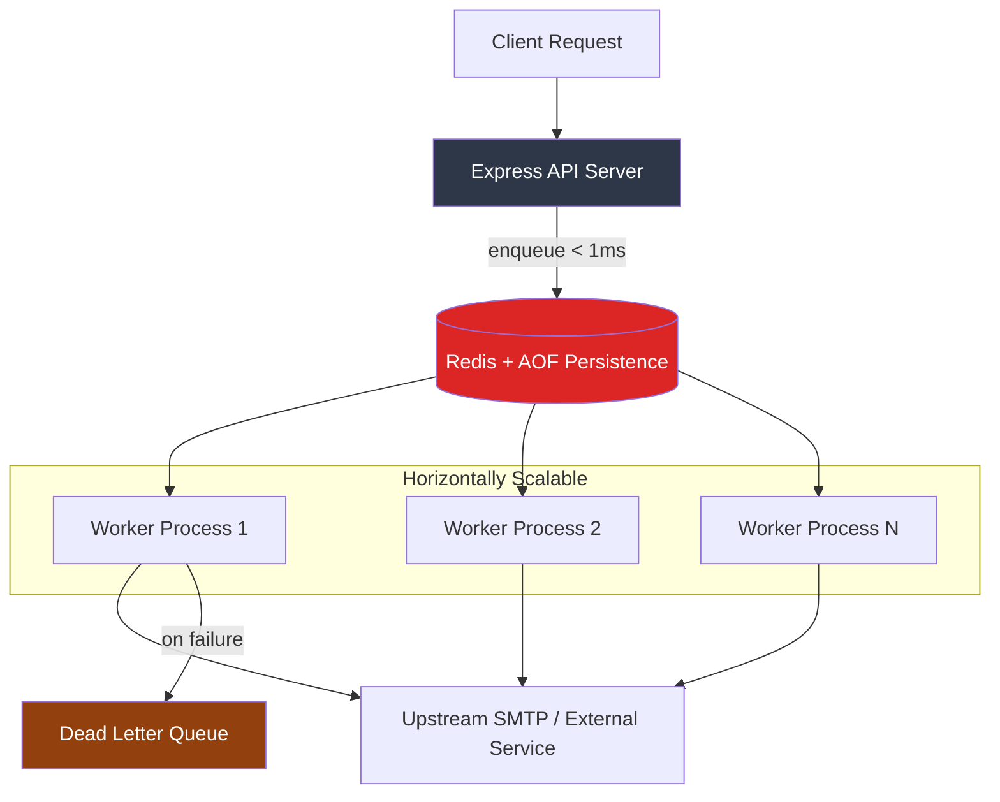

# Distributed Queue Engine

A production-grade background job processing system built on Redis and BullMQ. Decouples heavy I/O workloads from edge APIs via priority-aware queuing, exponential backoff retries, and independently scalable worker processes.

## Problem

Synchronous request handling in API servers creates cascading failures under load. A password reset email that takes 2s to send blocks the thread, degrades p99 latency, and creates a single point of failure when the upstream SMTP provider is slow or down.

This engine moves all heavy I/O to a fault-tolerant queue layer -- the API responds in <5ms regardless of downstream health.

## Architecture



**Key architectural decisions:**
- **Process isolation**: API and workers run as separate OS processes. Scaling workers does not require scaling API pods.
- **Redis hash slots**: Queue names use `{hash_tag}` notation (`{emails}:outbound`) ensuring all keys for a queue land on the same Redis Cluster shard -- required for atomic operations across related keys.
- **Priority routing**: Critical jobs (password resets) use priority `1`; bulk jobs use priority `10`. BullMQ's sorted-set-backed priority queue ensures critical jobs are dequeued first without starving lower-priority work.

## Tech Stack

| Technology | Why |
|---|---|
| **BullMQ 5.x** | Battle-tested Redis-backed queue with priority support, rate limiting, and Lua-scripted atomic operations. Chosen over RabbitMQ/SQS for simplicity of deployment and sub-millisecond enqueue latency. |
| **Redis 7 (AOF)** | Append-only file persistence ensures jobs survive restarts. Alpine image keeps container footprint under 30MB. |
| **ioredis** | Cluster-aware Redis client with automatic pipeline batching. `maxRetriesPerRequest: null` is required for BullMQ's blocking `BRPOPLPUSH` pattern. |
| **TypeScript** | Type safety across job payloads prevents runtime serialization bugs between producer and consumer. |

## Key Features

- **Exponential backoff retries** -- 3 attempts with 5s base delay (5s, 10s, 20s) before dead-lettering
- **Priority queuing** -- sorted-set-backed priority ensures critical jobs bypass bulk queues
- **Configurable concurrency** -- workers process N jobs in parallel (default: 10) via `QUEUE_CONCURRENCY` env var
- **Graceful shutdown** -- `SIGINT`/`SIGTERM` handlers drain in-flight jobs before process exit, preventing duplicate processing
- **Cluster-safe queue names** -- hash-tag notation ensures Redis Cluster compatibility without code changes
- **Memory management** -- `removeOnComplete: true` prevents unbounded Redis memory growth in high-throughput scenarios

## Scale Considerations

| Dimension | Current | Production Path |
|---|---|---|
| **Throughput** | ~6,600 jobs/s per worker (BullMQ benchmark) | Add workers linearly; Redis is rarely the bottleneck below 100K jobs/s |
| **Persistence** | Redis AOF | Redis Sentinel or Cluster for HA; or swap to Upstash/ElastiCache for managed durability |
| **Observability** | Console logging | Integrate with [otel-sdk-node](https://github.com/sudhanshu1402/otel-sdk-node) for distributed tracing across API, Queue, and Worker spans |
| **Backpressure** | None | Add BullMQ rate limiter (`limiter: { max: 100, duration: 1000 }`) to protect downstream SMTP rate limits |
| **Dead letters** | BullMQ default | Add DLQ consumer with alerting (PagerDuty/Slack webhook) for failed jobs |

## Failure Handling

1. **Transient SMTP failure** -- Job retries with exponential backoff (5s, 10s, 20s)
2. **Persistent failure after 3 attempts** -- Job moves to BullMQ's failed set (dead letter)
3. **Worker crash mid-processing** -- BullMQ's visibility timeout returns the job to the queue; another worker picks it up
4. **Redis restart** -- AOF persistence recovers all pending jobs from disk
5. **API server crash** -- Workers continue processing independently; no job loss

## Setup

```bash
# Start Redis
docker-compose up -d

# Install dependencies
npm install

# Run API server (port 3000)
npm run api:dev

# Run worker cluster (separate terminal)
npm run worker:dev
```

```bash
# Test: enqueue a priority job
curl -X POST http://localhost:3000/api/users/reset-password \
  -H "Content-Type: application/json" \
  -d '{"userId": "user_42"}'

# Response: {"message":"Password reset initiated asynchronously","jobId":"1"}
```

**Production deployment:**
```bash
docker build -t queue-engine .
# API and workers use the same image, different CMD
docker run -e REDIS_HOST=your-redis queue-engine node dist/api/index.js
docker run -e REDIS_HOST=your-redis queue-engine node dist/worker/index.js
```

## Future Improvements

- [ ] BullMQ Board UI for real-time queue monitoring and manual job retry
- [ ] Rate limiter integration to respect downstream SMTP provider limits (e.g., SendGrid 100/s)
- [ ] Cron-scheduled jobs for recurring tasks (daily digest emails)
- [ ] Job deduplication via custom job IDs to prevent duplicate sends on retry storms
- [ ] OpenTelemetry spans bridging API request to enqueue to worker processing for end-to-end tracing

## Deep-Dive Architecture

For a complete system design breakdown with detailed Mermaid.js diagrams, visit the [System Design Portal](https://sudhanshu1402.github.io/system-design-portal/queue-engine).

## License

MIT
