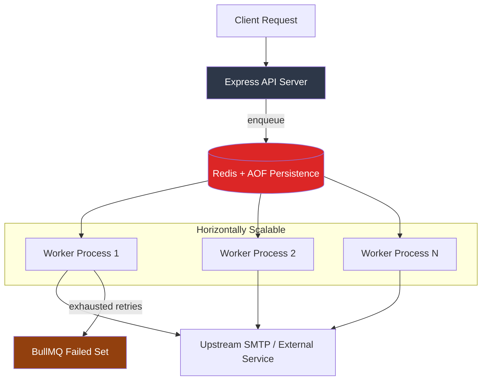

<h1>
<picture>
  <source media="(prefers-color-scheme: dark)" srcset="https://raw.githubusercontent.com/sudhanshu1402/distributed-queue-engine/main/assets/banner-dark.svg" />
  <source media="(prefers-color-scheme: light)" srcset="https://raw.githubusercontent.com/sudhanshu1402/distributed-queue-engine/main/assets/banner-light.svg" />
  
</picture>
</h1>

[](https://github.com/sudhanshu1402/distributed-queue-engine/actions/workflows/ci.yml) [](LICENSE)


A Redis + BullMQ background job engine: priority-aware queuing, exponential-backoff retries, workers that scale independently of the API. The problem it solves: a slow password-reset email (the processor simulates 1.5s of I/O) holds the request open. Enqueue instead, return `202` immediately, let a worker send it.

`src/worker/processor.ts` simulates the send (`setTimeout` plus a ~20% random failure) so retries and priority routing run end to end with no live SMTP provider. Swap `createEmailProcessor` for a real send and the plumbing is unchanged. **Redis is required to run this for real** (Docker, see [Run it](#run-it)); the proof on this page is the offline test suite below, not a live run.

## Architecture


```mermaid
graph TB
    Client[Client Request] --> API[Express API Server]
    API -->|enqueue| Redis[(Redis + AOF Persistence)]
    Redis --> W1[Worker Process 1]
    Redis --> W2[Worker Process 2]
    Redis --> WN[Worker Process N]
    W1 --> SMTP[Upstream SMTP / External Service]
    W2 --> SMTP
    WN --> SMTP
    W1 -->|exhausted retries| DLQ[BullMQ Failed Set]

    subgraph "Horizontally Scalable"
        W1
        W2
        WN
    end

    style API fill:#2d3748,color:#fff
    style Redis fill:#dc2626,color:#fff
    style DLQ fill:#92400e,color:#fff
```

`src/api` and `src/worker` are separate entry points sharing only the queue definition and Redis config. Separate processes, separate containers in production.

| Decision | Why |
|---|---|
| Queue name `{emails}:outbound` | hash tag pins every key to one Redis Cluster slot, for a later multi-node move |
| API and worker are separate processes | scale workers for throughput without touching the API tier |
| Priority 1 (reset) vs 10 (other) | BullMQ's sorted-set queue drains the urgent ones first |
| `attempts: 3`, exponential backoff, 5s base | two retries at 5s then 10s before the failed set |
| `SIGINT`/`SIGTERM` call `worker.close()`, 15s cap | a rolling deploy drains in-flight jobs instead of dropping them |

Full reasoning, plus what happens on a worker crash, a Redis restart, and a close that hangs, in [docs/DECISIONS.md](docs/DECISIONS.md).

## Run it

Needs Node 20+ and Docker.

```bash
docker-compose up -d      # Redis with AOF on :6379
npm install
npm run api:dev           # API on :3000
npm run worker:dev        # separate terminal
```

```bash
curl -X POST http://localhost:3000/api/users/reset-password \
  -H "Content-Type: application/json" -d '{"userId": "user_42"}'
# -> {"message":"Password reset initiated asynchronously","jobId":"1"}
```

The worker logs each pickup, completion, and failure; since the processor fails ~20% by design, you'll see retries back off. Config is env vars, see `.env.example`.

## Tests

```bash
npm test
```


Jest, no live Redis: the processor's `sleep`/RNG are injectable, the producer test mocks `ioredis`/`bullmq` and asserts the exact retry, backoff and priority options passed to `queue.add`. CI runs Node 20 and 22; `npm run assets` regenerates the images above from that same output.

## Deploy

Multi-stage `Dockerfile`, `node:22-alpine`, non-root user. One image runs both roles:

```bash
docker build -t queue-engine .
docker run -e REDIS_HOST=your-redis queue-engine node dist/api/index.js
docker run -e REDIS_HOST=your-redis queue-engine node dist/worker/index.js
```

`render.yaml` covers a one-service API deploy.

## What it doesn't do

- Single Redis node. Production wants Sentinel, Cluster, or a managed service.
- No backpressure. A downstream provider with rate limits needs BullMQ's limiter.
- Nothing consumes the failed set, so dead letters sit there unalerted.
- Console logs only. Tracing across API, enqueue, and worker would come from [otel-sdk-node](https://github.com/sudhanshu1402/otel-sdk-node).
- No job deduplication, so a retry storm can double-send.

## Deep-dive

Fuller write-up with diagrams at the [System Design Portal](https://sudhanshu1402.github.io/system-design-portal/queue-engine).

## License

MIT
